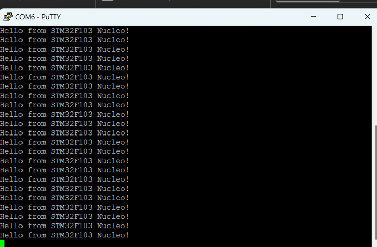

<!DOCTYPE html>
<html>
<head>
    <title>Testing the STM32 Board</title>
</head>
<body>
    <h1>Testing STM32 Board</h1>
    
This repository contains basic code for checking the communication between a PC and an STM32 board. The purpose of this project is to get familiarized with the STM32 microcontroller and ensure proper communication setup.

    
  <h2>Project Overview</h2>
    
This project includes basic code that establishes communication between a PC and an STM32 microcontroller. It serves as an introductory exercise to help users understand the basics of STM32 programming and communication.

    
  <h2>Requirements</h2>
    <ul>
        <li>STM32 Development Board</li>
        <li>USB to TTL Converter</li>
        <li>STM32CubeIDE</li>
        <li>USB Cable</li>
        <li>Windows/Linux/Mac OS</li>
    </ul>
    
  <h2>Setup and Installation</h2>
    <ol>
        <li>
            <b>Clone the Repository</b>
            <pre><code>git clone https://github.com/mohdnaser1604/testing_stm32.git 
cd testing_stm32board
            </code></pre>
        </li>
        <li><b>Open the Project in STM32CubeIDE</b>
            <ul>
                <li>Launch STM32CubeIDE.</li>
                <li>Open the project folder in the IDE.</li>
            </ul>
        </li>
        <li><b>Build the Project</b>
            <ul>
                <li>Click on the build button to compile the code.</li>
            </ul>
        </li>
        <li><b>Upload the Code to the STM32 Board</b>
            <ul>
                <li>Connect the STM32 board to your PC using the USB cable.</li>
                <li>Upload the compiled code to the STM32 board.</li>
            </ul>
        </li>
        <li><b>Check Communication</b>
            <ul>
                <li>Use a serial terminal (e.g., Tera Term, PuTTY) to open the corresponding COM port.</li>
                <li>Set the baud rate and other serial settings as required.</li>
                <li>Verify that the STM32 board communicates correctly with the PC.</li>
            </ul>
        </li>
    </ol>
    
   <h2>Output</h2>
    
Below is an example of the output from the serial terminal:

    
    
   <h2>Usage</h2>
    
This project can be used as a starting point for learning STM32 programming and communication. Modify the code to test different functionalities and peripherals of the STM32 board.

    
  <h2>Contributing</h2>
    
Contributions are welcome! Please feel free to submit a Pull Request.

    
  <h2>License</h2>
    
This project is licensed under the MIT License.

</body>
</html>

